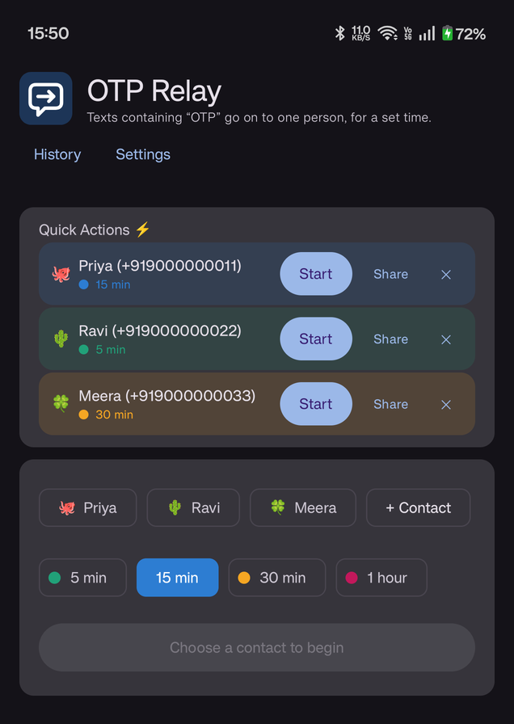
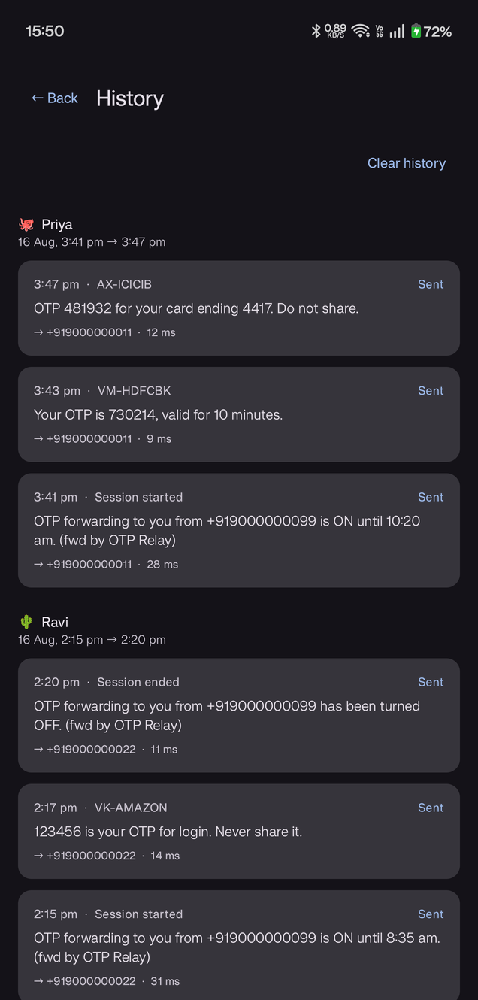

<p align="center">
  
</p>

<h1 align="center">OTP Relay</h1>

<p align="center">
  <sub><i>For when someone you trust needs an OTP and you would rather not stop what you are doing.</i></sub>
</p>

<p align="center">
  <b>Forward OTP texts to one person, for a set time.</b>
  <br>
  Pick a contact and a duration; any text with the word "OTP" in it is relayed over your own SIM
  until the time is up.
  <br>
  <br>
  No server, no SMS gateway, no network calls.
</p>

<p align="center">
  <a href="https://github.com/seeknull/otp-relay/releases/latest"><b>Download the latest APK</b></a>
  &nbsp;·&nbsp; Android 8.0+ &nbsp;·&nbsp; MIT
</p>

<p align="center">
  
  &nbsp;
  
</p>

## How to use

Three ways to start. Each one stops by itself when the time is up.

**👤 1. Pick a contact**  
Tap **+ Contact**. Pick a name. Pick a time. Tap **Start**.

**⚡ 2. Save a quick action**  
Do the same, and tap **Save quick action**. Next time it is one tap.

**🔗 3. Send a link**  
Tap **Share**. Send the link on WhatsApp. They keep it.
When they need a code, they send the link back. You tap it and approve.

It never starts by itself. You always tap. Codes only go to a name in your phone book.

## Install

Download the APK from [Releases](https://github.com/seeknull/otp-relay/releases/latest) and open it.
Two things get in the way, both Android's rather than the app's.

**Play Protect may stop the install**, because the app declares `RECEIVE_SMS`. That check exists to
catch apps quietly intercepting passcodes; it cannot see what makes this one different, so it stops
the category. You get one of two dialogs:

| What you see | What it means |
| --- | --- |
| **More details → Install anyway** | The ordinary warning. Tap through. |
| Only an **OK** button | A hard block, piloted in India, Singapore, Thailand and Brazil. |

Past a hard block, best first:

- **Pause scanning** — Play Store → profile → Play Protect → **⚙**. Re-enable it after. It can
  remove the app once scanning resumes.
- **adb**, which verifies installs separately and by default. Turn that off for the one command:

  ```
  adb shell settings put global verifier_verify_adb_installs 0
  adb install otp-relay-*.apk
  adb shell settings put global verifier_verify_adb_installs 1
  ```
- **[Shizuku](https://shizuku.rikka.app/) with InstallerX** — no computer needed, and it sticks.

**Then lift the SMS restriction**, or the permission stays greyed out and no prompt appears:

> Settings → Apps → OTP Relay → **⋮** → **Allow restricted settings**

Now press start. The app checks everything a session needs — SMS access, notifications, a working
SIM, battery limits — and explains anything missing with a button to the right screen.

## Features

- Sessions of 5, 15, 30 or 60 minutes.
- **Only saved contacts can receive OTPs.** The number must be chosen from your phone book, so a
  link from a stranger cannot point forwarding somewhere unknown.
- **Adding a contact or saving a quick action needs your fingerprint**, or whatever unlock the phone
  uses. Starting a session does not — the check guards what grants access, not what uses it.
- **No notification, no forwarding.** A session will not start without a visible notification, and
  stops itself within 5 seconds if that notification is ever blocked or removed.
- Quick actions — save a person and a duration, start with one tap.
- A short beep on each relay, so you know without looking.
- The recipient is texted when a session starts and ends.
- Every message sent is logged, grouped by session, with how long it took to go out.
- **Request links** — send someone a link; they send it back when they need an OTP, and it opens
  the approval prompt filled in. Nothing starts until you approve.

Forwarded texts name who the code came from and are marked `(fwd by OTP Relay)`. Sending is quick,
because OTPs expire: the message reaches the modem before anything touches disk, usually well under
50 ms.

## Privacy

No data is collected or shared. No analytics, no accounts, no cloud backup, no server.

- **Nothing can be uploaded.** The app does not hold the `INTERNET` permission, so it cannot reach
  the network even in principle. That is checkable in the manifest rather than taken on trust.
- **SMS is only read while a session is running.** Outside a session the app is not watching.
- The inbox is never read — messages come from the incoming broadcast, so no `READ_SMS`. Anything
  without "OTP" is ignored and never stored.
- Forwarded messages are kept in the on-device log so you can check what went out. It sits in
  private storage, is excluded from Android backup, and never leaves the phone.
- Request links carry only a number, after the `#`, which browsers never send to a server — so it
  never reaches GitHub even if the recipient does not have the app. A link never carries a name,
  because that would be sender-controlled text sitting beside a phone number.

The usual caveat: whichever chat app you send a link through can see it, like any message.

## Permissions

| Permission | Why it is needed |
| --- | --- |
| `RECEIVE_SMS` | Read incoming texts during a session |
| `SEND_SMS` | Send the forwarded text and the start/stop notices |
| `POST_NOTIFICATIONS` | Show the "forwarding is on" notification |
| `FOREGROUND_SERVICE` | Keep listening for the length of the session |
| `FOREGROUND_SERVICE_SPECIAL_USE` | The category that fits an SMS relay |
| `USE_BIOMETRIC` | Confirm it is you before a contact is allowed |

All are required. `USE_BIOMETRIC` is granted automatically, and the biometric library adds the
older `USE_FINGERPRINT` beside it.

Not requested: `READ_SMS`, `READ_CONTACTS`, `READ_PHONE_NUMBERS`, `INTERNET`,
`REQUEST_IGNORE_BATTERY_OPTIMIZATIONS`.

## Build your own APK

Needs the Android SDK (platform 36) and JDK 17 or newer.

```
git clone https://github.com/seeknull/otp-relay.git
cd otp-relay
echo "sdk.dir=$ANDROID_HOME" > local.properties

./gradlew test              # unit tests
./gradlew assembleDebug
adb install -r app/build/outputs/apk/debug/app-debug.apk
```

For a **release** APK, create a keystore once and point the build at it:

```
keytool -genkeypair -v -keystore ~/otp-relay.keystore -alias otprelay \
  -keyalg RSA -keysize 2048 -validity 10000

./gradlew assembleRelease \
  -Potprelay.keystore=$HOME/otp-relay.keystore \
  -Potprelay.storePassword=... -Potprelay.keyAlias=otprelay -Potprelay.keyPassword=...
```

Keep that keystore. Debug builds use it too when present, so a downloaded release installs straight
over one you built — Android blocks updates whenever the signing certificate changes. Without it,
debug falls back to the standard debug key and release is left unsigned.

Debug builds can load made-up contacts and history for screenshots, in memory only, so real data is
untouched and returns on the next launch:

```
adb shell am start -n com.guru.otprelay/.MainActivity --ez demo true
```

## Google Play

**Unlikely to be accepted.** Play restricts SMS permissions to default SMS, Phone or Assistant
handlers. The one [exception](https://support.google.com/googleplay/android-developer/answer/10208820)
that might fit — device automation — is meant for general automation apps, needs a declaration form
and review, and auto-relaying passcodes resembles the fraud pattern reviewers screen for.

The core function is the problem, not the code. Sideloading avoids the review, though not Play
Protect — see [Install](#install).

## Notes

- A reboot ends any running session, and only one session runs at a time.
- "My number" is optional and typed once. It cannot be detected reliably, because most carriers do
  not write your number to the SIM.
- Request links are verified App Links, so they open the app rather than a browser. Verification is
  tied to the host *and* the signing key, so forks need their own: point `WEB_HOST` in
  `RequestLink.kt` and the manifest at a host you control, and serve your certificate fingerprint
  from `/.well-known/assetlinks.json` there.
- Some phones stop background apps aggressively, cutting a session short. Settings has a link to
  Android's battery screen.

## Licence

MIT — see [LICENSE](LICENSE).
